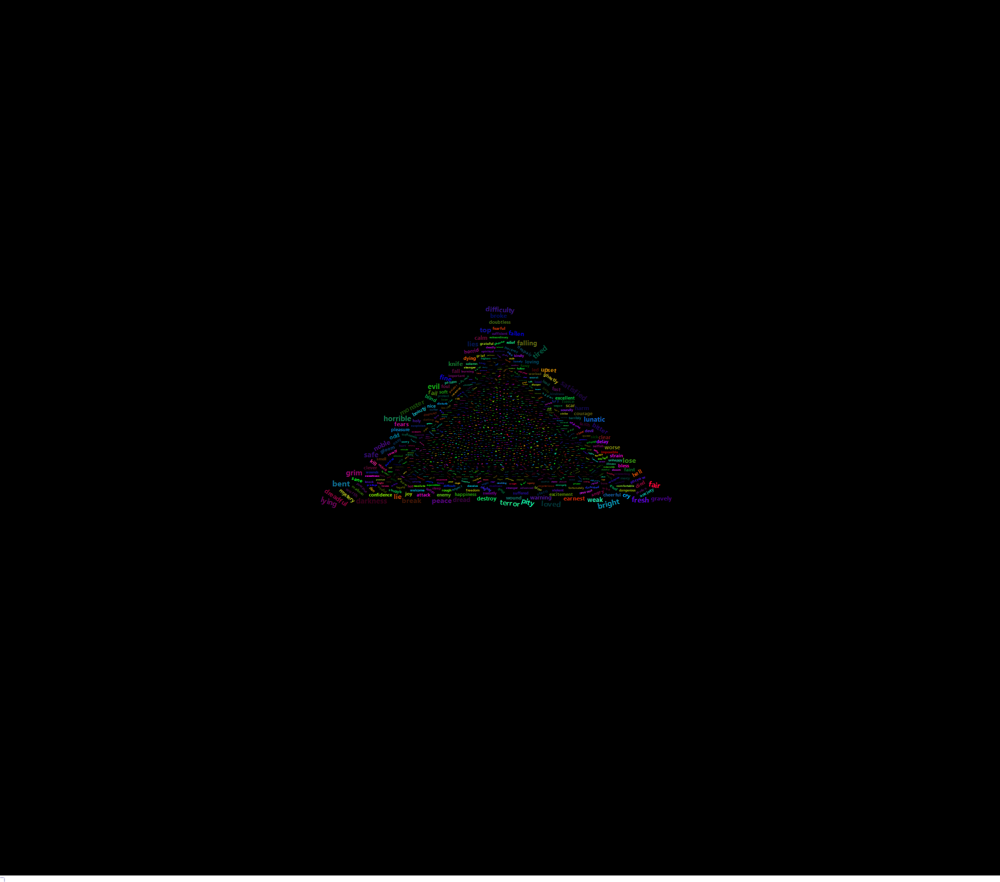
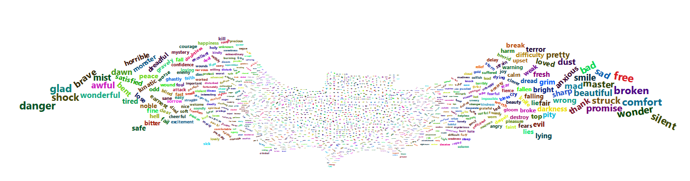

## Introduction

[Wordclouds](/post/creating-a-wordcloud/) are great tools to quickly see the words used in a piece of text, but they can get boring to look at. In this post, we introduce a new R package called wordcloud2. This package will dynamically plot the wordcloud on screen, add hoverability to each word, and be able to form the wordcloud into different shapes.

## Getting our Data

Once again, we will use the text from Bram Stoker's "Dracula". For a more indepth explanation of how we get this data, please see the post ["Simple Sentiment Analysis"](/post/simple-sentiment-analysis/).

```{r message=FALSE, warning=FALSE}
library(gutenbergr)
library(tidytext)
library(dplyr)
library(wordcloud2)

dracula<-gutenberg_download(345)
dracula$gutenberg_id<-NULL

dracula<-dracula%>%
  unnest_tokens(word, text)

bing<-get_sentiments('bing')
dracula<-inner_join(dracula, bing)
```

We also need to count up the number of occurrences of each word in the text, using dplyr.

```{r message=FALSE, warning=FALSE}
words<-dracula%>%
  group_by(word)%>%
  summarize(count=n())%>%
  arrange(count)
```

## Using wordcloud2

Wordcloud2 has several options for how to shape the wordcloud. The available shapes are:
* circle
* cardioid
* diamond
* triangle
* triangle-forward
* pentagon
* star

For this example, we will make a triangle of the words, and also change the background color to be black.

```{r eval=FALSE, message=FALSE, warning=FALSE}
wordcloud2(words, shape='triangle', backgroundColor='black')
```



[View Interactive Version](wordcloud2-example.html)

Another fun way to use wordcloud2 is to plot the wordcloud using an image of any shape. The image must have a clear delineation between light and dark colors.  Here, we have a simple image of a bat, which we can pass to wordcloud2 and its shape will resemble our image.

```{r eval=FALSE, message=FALSE, warning=FALSE}
wordcloud2(words, figPath='bat.jpg')
```



[View Interactive Version](wordcloud2-example-fig.html)


## Displaying wordcloud2 Output

It appears that the setup currently applied to this blog will not allow the dynamic version of wordcloud2 to execute within a post. The images above were saved to files using a code snippet found [here](https://github.com/Lchiffon/wordcloud2/issues/8). This method saves the wordcloud2 (which is build using the htmlwidgets R package) to an HTML file, and then uses phantomjs from the webshot R package to convert it to an image file. The code to save the wordcloud2 output to an image file is below.  This method, however, does not appear to work when using a custom shape via the figPath parameter.

```{r eval=FALSE}
wc = wordcloud2(words, shape='triangle', backgroundColor='black')
saveWidget(wc,"wordcloud.html",selfcontained = F)
webshot::webshot("wordcloud.html","wordcloud.png",vwidth = 1992, vheight = 1744, delay =10)
```


### The Code

The code for this post can be found on my [GitHub Gists page](https://gist.github.com/rer145/edb11422ad6ceffe220b9002fa4624d0).